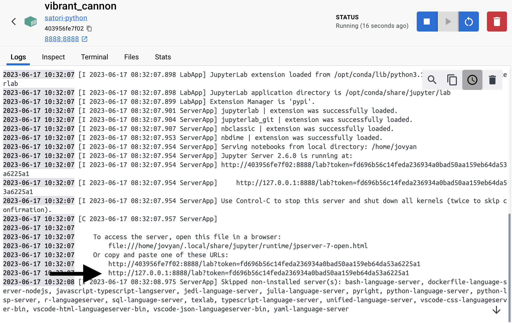
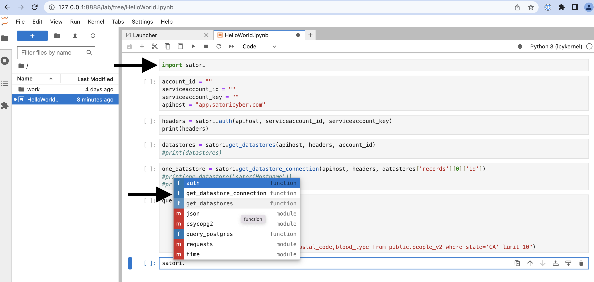

## Satori Python Wrappers and Module


_Some simple wrappers and dockerization for Satori using JupyterLab_


### Installation

We tested with Docker on MacOS. Once you run the steps below, you should have a running instance in Docker Desktop.

1. Download this repo and unzip or git clone
2. navigate to the new directory
3. ```docker build -t satori-python .```
4. ```docker run -dp 8888:8888 satori-python```
5. Open the Docker Desktop Dashboard and find your new running container, then click its internal name to view logs.
6. In the log output you should see a JupyterLab URL with a token, e.g.:



7. This will log you into JupyterLab
8. There is one single "HelloWorld" jupyter notebook at the root level of the workspace:


